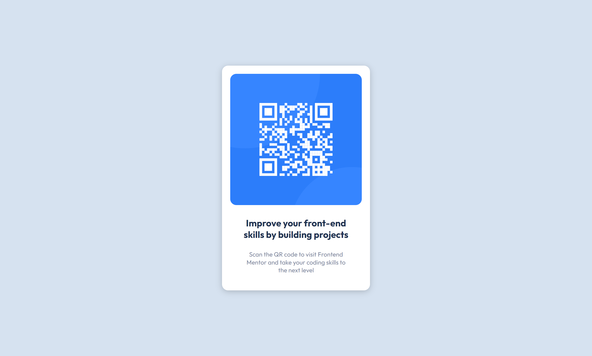

# Frontend Mentor - QR code component solution

This is a solution to the [QR code component challenge on Frontend Mentor](https://www.frontendmentor.io/challenges/qr-code-component-iux_sIO_H). Frontend Mentor challenges help you improve your coding skills by building realistic projects. 

## Table of contents

- [Overview](#overview)
  - [Screenshot](#screenshot)
  - [Links](#links)
- [My Process](#my-process)
  - [Built with](#built-with)
  - [What I Learned](#what-i-learned)
  - [Continued Development](#continued-development)
  - [Useful Resources](#useful-resources)
- [Author](#author)

## Overview
In This Challenges i learn how to make responsive image, how can i use a flex, and how can i made my card as close as that in design 

### Screenshot

### Links

- Solution URL: [Add solution URL here](https://github.com/GE08T/Qr-Code-Components-Using-Mobile-First)
- Live Site URL: [Add live site URL here](https://your-live-site-url.com)

## My process
I start by building mobile first, and i found strugle when i start to buil image because of the width of image, and soon i realize what is my problem and i finally did it.

### Built with

- Flexbox
- Mobile-first workflow

### What I learned

i learn flexbox

### Continued development

i'm not gonna continue develop this cause i just wanna accept this challenge like games

### Useful resources

- [css flexbox](https://www.w3schools.com/css) - This helped me for creating flexbox and all about css

## Author

- Website - [Galung Erlyan Tama](https://ge08t.github.io/)
- Frontend Mentor - [@yourusername](https://www.frontendmentor.io/profile/GE08T)

